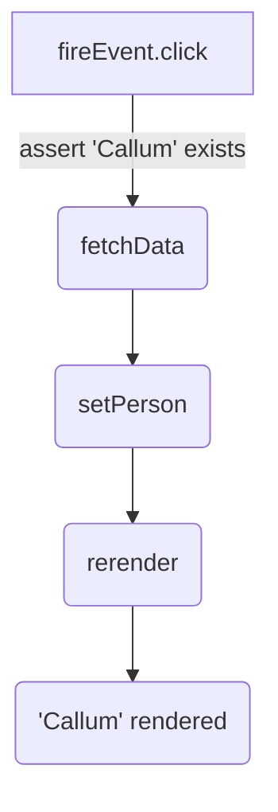
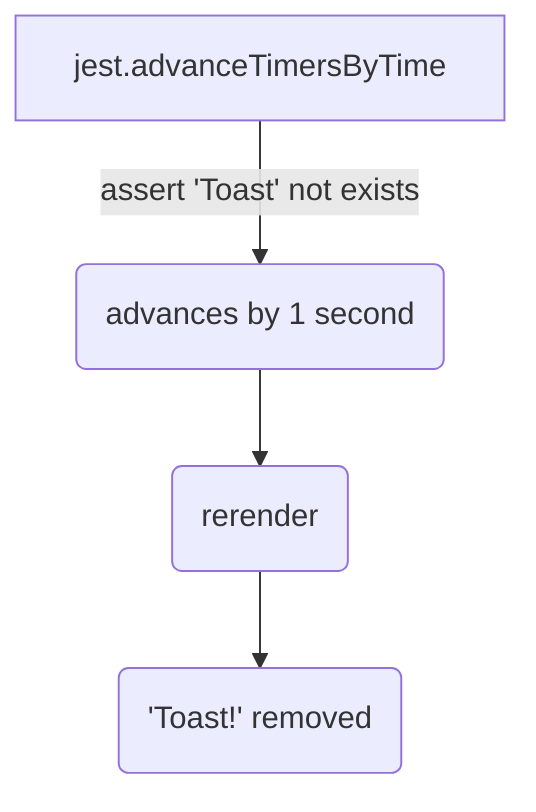
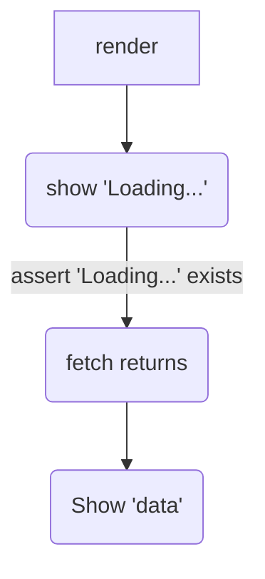

## 🛂
# Advanced Testing concepts
Another *CodingWithCallum™️* Session
 
note: 

This presentation was written using obsidian slides which is why the markdown looks a little weird, see attached PDF output and notes of every slide.

Everything underneath "note" below are speaker notes to remind me what to talk about

---

# What are we going to talk about?

- Async rendering in React Testing Library (RTL)
	- wtf is `act`
- Ordering queries in RTL (a11y, eg. getByRole > getByDataId)

note:

This is going to be a more advanced talk where I expect an understanding of testing at high level

If you don't understand any of the core concepts please send me a message so I can organise another sessinon around this

I've only got an hour so will get through as much as I can

---

Abbrevs:

- Async = Asynchronous
- RTL = React Testing Library
- MSW = Mock Service Worker
- Abbrev = Abbreviation

---

# Async rendering in React Testing Library

Wtf is this `act` warning and why do i see it all the time?

```tsx
When testing, code that causes React state updates should be wrapped into act(...):  
  
act(() => {  
  /* fire events that update state */  
});  
/* assert on the output */  
  
This ensures that you're testing the behavior the user would see in the browser. Learn more at https://fb.me/react-wrap-tests-with-act
```

---

# But Why?

> React is trying to warn us something happened when we expected nothing to happen at all

This can happen, before, during or after (most likely) the test

note:

There was an async rendering event that occured during or after the test ended

---

## Example 1: Async Updates

```tsx
const ShowName = () => {
  const [person, setPerson] = useState();
  const handleFetch = useCallback(async () => {
    const { data } = await fetchData(); // Returns { name: "Callum" }
    setPerson(data.person); // <- Asynchronous update
  }, []);
  return (
	<button type="button" onClick="handleFetch">
	    {person ? person.name : "Fetch"}
    </button>
  );
};
```

```tsx
it("should fetch persons name", () => {
  render(<ShowName />);
  fireEvent.click(screen.getByText("Fetch"));
  expect(screen.getByText("Callum")).toBeInTheDocument();
});
```

note:

Running the above test will result in a "not wrapped in act" error

`fireEvent.click` triggers `fetchData` to be called, which is an async call
We are asserting on text "Callum" to exist immediately and not waiting for fetch to return to make the assertion

---

## Example 1: Sequence



---

## Example 1: Solution

```tsx
it("should fetch persons name", async () => {
  render(<ShowName />);
  fireEvent.click(getByText("Fetch"));
  expect(screen.getByText("Fetch names")).toBeInTheDocument();
  expect(await screen.findByText("Callum")).toBeInTheDocument(); // same as waitFor -> getByText
});
```

note:

So on first render we know that the "Fetch names" `<h1>` exists in the code so we can get that element immediately but we need to assert on the component once it has finishing updating

Before assertions, wait for component update to fully complete by using `waitFor`. `waitFor` is an API provided by React testing library to wait for the wrapped assertions to pass within a certain timeout window.

---

## Example 2: Timers

```tsx
const Toast = () => {
  const [isVisible, setIsVisible] = useState(true);
  useEffect(() => {
    setTimeout(() => { setIsVisible(false); }, 1000); // hide after 1 seconds
  }, []);
  return isVisible && <div>Toast!</div>;
	};
```

```tsx
it("should display Toast for 1 second", () => {
  jest.useFakeTimers();
  render(<Toast />);
  jest.advanceTimersByTime(1000);
  expect(screen.queryByText("Toast!")).not.toBeInTheDocument();
});
```

note:

Let's say you need a `setTimeout` or `setInterval` for some reason

Our test utalises jest's `useFakeTimers` functionality to manipulate time (Timelord Callum has a nice ring to it)
BUT
Advancing timers in this case takes milliseconds to run the function to tell jest to advance the timers but not to run the advanceTimer function itself
So the call stack will be `jest.advanceTimersByTime` for 1ms then immediately query for `Toast` which will fail, the test will end then the timers will advance by 1 second causing a `act` error

---
## Example 2: Sequence



---

## Example 2: Solution

```tsx
it("should display Toast for 1 second", () => {
  jest.useFakeTimers();
  render(<Toast />);
  act(() => { // Actually wrap it in an act 😅
    jest.advanceTimersByTime(1000);
  });
  expect(screen.queryByText("Toast!")).not.toBeInTheDocument();
});
```

note:

Wrap Jest’s timer manipulations in an `act` block, so test will know that advancing time will cause component to update
This effectively changes the call stack now to `jest.advanceTimersByTime` > advance by 1 second > query for `Toast` > finish test

---

## Example 3: Premature Exit

```tsx
const ShowName = () => {
  const { loading, data } = await fetchData(); // Returns { name: "Callum" }
  return loading && data?.name ? (
    <div>Loading...</div>
  ) : (
    <div>{data.name}</div>
  );
};
```

```tsx
it("should display loading state", () => {
  const render(<ShowName />);
  expect(screen.getByText("Loading ...")).toBeInTheDocument();
});
```

note: 

This test will pass, BUT, the `it` block exists before the data comes back and the rerender is triggered, this also causes `act` errors

---

## Example 3: Sequence



---

## Example 3: Solution

```tsx
it("should display loading state", () => {
  const render(<ShowName />);
  expect(getByText("Loading ...")).toBeInTheDocument();
  await waitFor(() => {
    expect(queryByText("Loading ...")).not.toBeInTheDocument();
  });
});
```

even better...

```tsx
it("should display loading state", () => {
  const render(<ShowName />);
  expect(getByText("Loading ...")).toBeInTheDocument();
  await waitForElementToBeRemoved(() => queryByText("Loading ..."));
});
```

note:

Make sure the test exits after all the rendering and updates are done. 
To do that, we can wait for the loading state to disappear or assert on the content to come back (but that is probably a different test)

Alternatively, you can use `waitForElementToBeRemoved` which is a wrapper around `waitFor`.

Loading a library that attaches rendering states to inputs (like the Join team realised that `react-hook-form` does) which spurred this talk

---

# Phew 😮‍💨

That was fun, questions?

note:

before I jump into ordering selectors in React Testing Library, any questions?

Ill try to add questions and answers to this doc

---

# Ordering of Queries in RTL

- What should I use in what circumstance?
- How do I remember all these queries?
- Whats the difference?
- Water break🚰

---

## Types of queries

At high level there's 3 types

- `GET` - returns match but fails if none found 
	- `getByText("Callum")`
- `QUERY` - returns match but `null` if none found 
	- `expect(queryByText("Callum").not.toBeInTheDocument())`
- `FIND` - returns promise that resolves with match found or errors on 1000ms timeout
	- `await findByText("Callum")`

note:

Am trying to build it from ground up so this sticks in your mind as you'll be using it a lot

---

## Single vs Multiple

- Single (`by`)
	- `getBy`
	- `queryBy`
	- `findBy`
- Multiple (`allBy`)
	- `getAllBy`
	- `queryAllBy`
	- `findAllBy`

note:

let's evolve the get, query, find

---

## The table

|   Query Type   |  0 Match  |     1 Match    |  >1 Match  | Async/Await |
|:-----------------:|:-----------:|:--------------:|:------------:|---------------------|
| Single Element    |             |                |              |                     |
| getBy...          | Throw error | Return element | Throw error  | No                  |
| queryBy...        | Return null | Return element | Throw error  | No                  |
| findBy...         | Throw error | Return element | Throw error  | Yes                 |
| Multiple Elements |             |                |              |                     |
| getAllBy...       | Throw error | Return array   | Return array | No                  |
| queryAllBy...     | Return []   | Return array   | Return array | No                  |
| findAllBy...      | Throw error | Return array   | Return array | Yes                 |

note:

Now the high level

I'd strongly reccomend having this saved as a screenshot or a quick reference somewhere while you're getting used to react testing library as it's super handy

---

## Order of querying

1. Focus on accessibility (reflect the experience of visual/assistive users)
2. Semantic Queries (HTML5 and ARIA compliant selectors)
3. Test IDs (last resort, user cannot see or hear these)

note:

Now to the meaty section

First we want to focus on querying elements that are exposed in the accessibility tree

This should be your top preference for just about everything. If you can't, it's possible your UI is inaccessible and need sto be re-written

Second we want to target HTML5 and ARIA compliant selectors

---

## 1. Focus on Accessibility

- `getByRole` - can be used to query every element that is exposed in the [accessibility tree](https://developer.mozilla.org/en-US/docs/Glossary/AOM)
	- `name` option can filter the returned elements by their [accessible name](https://www.w3.org/TR/accname-1.1/)
	- Check the [list of accessible roles](https://developer.mozilla.org/en-US/docs/Web/Accessibility/ARIA/ARIA_Techniques#Roles)
	- eg. `getByRole('button', {name: /submit/i})`
- `getByLabelText`
	- Navigating form fields
- `getByText`
	- Outside of forms, text content is the main way users find elements
- `getByDisplayValue`
	- Navigate a page with filled in values

note:

---

## 2. Semantic Queries

- `getByAltText` - If your element is one which supports alt text (img, area, input, and any custom element), then you can use this to find that element.
- `getByTitle` - The title attribute is not consistently read by screenreaders, and is not visible by default for sighted users

---

## 3. Test IDs

- `getByTestId`: The user cannot see (or hear) these, so this is only recommended for cases where you can't match by role or text or it doesn't make sense (e.g. the text is dynamic).
 
---

## Finally 

- use `await findByRole()` to avoid rendering problems and be as accessible as possible
- check our console, `act` errors are painful and cause 

---

# Further Reading
- [Fix the "not wrapped in act(...)" warning](https://kentcdodds.com/blog/fix-the-not-wrapped-in-act-warning)
- [React testing library - queries](https://testing-library.com/docs/queries/about)
- [The accessibility tree](https://developer.mozilla.org/en-US/docs/Glossary/Accessibility_tree)
- [Accessible names](https://www.w3.org/TR/accname-1.1/)
- [List of accessible roles](https://developer.mozilla.org/en-US/docs/Web/Accessibility/ARIA/ARIA_Techniques#roles)
