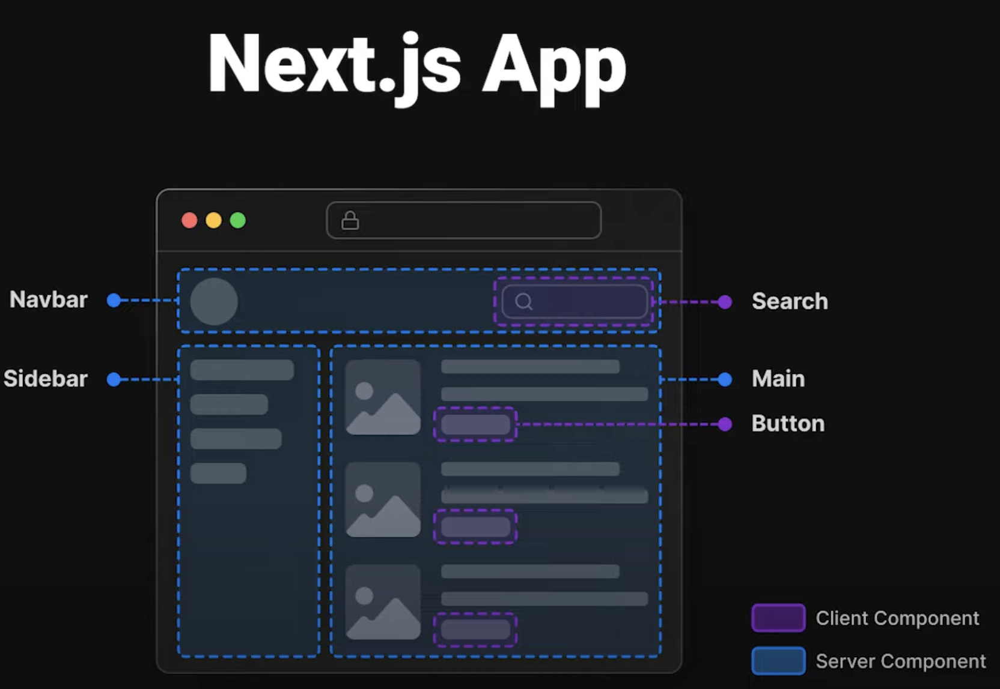
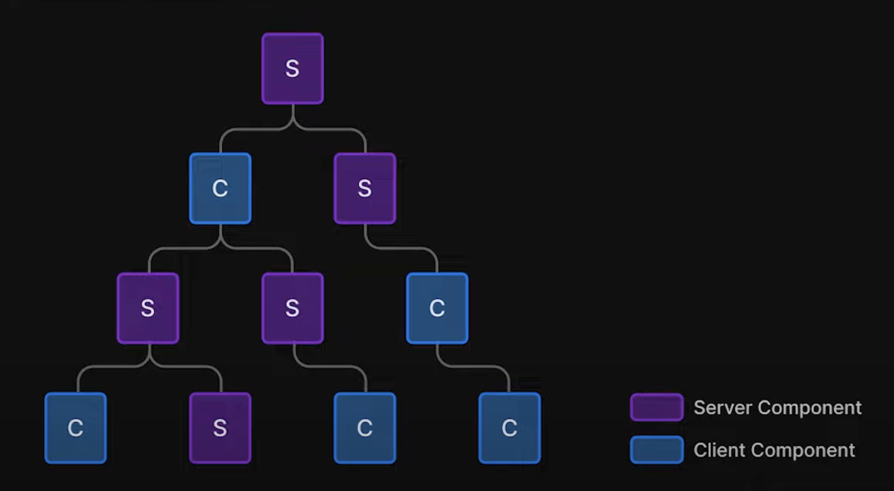

## 🛄 vs 📳
# Next 13 Server Components
Another *CodingWithCallum™️* Session


*⚡️ lightning talk ⚡️*
 
note: 

This presentation was written using obsidian slides which is why the markdown looks a little weird, see attached PDF output and notes of every slide.

Everything underneath "note" below are speaker notes to remind me what to talk about

I've picked the emojis to represent server vs client components so it gives some visual clarity as we go through

Ok let's start with definitions

---

# 🛄 Server Component

A component that is `fetched` and `rendered` *ON THE SERVER*

note:

blue briefcase felt right

---

## 📳 Client Component

A component that is `fetched` and `rendered` *ON THE CLIENT*

note:

phone is client... right?

---

# Examples



note:

I pulled this direct from the next docs which is a great example of using different pieces / where should they go, Ill reference this a few times within this presentation

---

## Using server components 🛄 

- Only download HTML built by the server
	- Instant render
	- Speed 🏃‍♀️💨
- \+ the JS required for the client components
	- (if any)
	- react cached
- Make direct API calls (server to server)

note:

so the more server components you use, the faster your application will be

---

## Not using server components 📳

- Install all JS Dependencies to run the site
	- React etc.
- Then grab all our Client JS
	- Components
- Then render

note:

so we're missing a few steps

---

# When to use Server 🛄 vs Client 📳 Components

Need to access browser related stuff = Client Component

Anything Else? = Server Component

note:

[NextJS has a big table in their docs](https://beta.nextjs.org/docs/rendering/server-and-client-components#when-to-use-server-vs-client-components) that goes into more detail but we're going to simplify it

If you need to access any react hooks these will go into client components

---


note:

Ok lets have a look at this again

User hits the page all of the blue boxes instantly render, the client (purple) is loading

The search bar in the top RHS may contain handlers on client side for the text input therefore client component

Buttons use an onClick event which needs the client so... client components

Everything else can be built on the server easily

---

#  Interleaving



note:

You can have server within client and verse-vica

Client components should be leaves in the tree, trying to avoid having children under it.

There is a gotcha here though you cannot import a server component directly into a client component
Instead you pass a server component as a child or a prop of a client component

---

# How do I define a Client 📳 Component

```tsx
'use client';

import { useState } from 'react';

export default function Counter() {
  const [count, setCount] = useState(0);

  return (
    <div>
      <p>You clicked {count} times</p>
      <button onClick={() => setCount(count + 1)}>
        Click me
      </button>
    </div>
  );
}
```

note:

You only need to make components as use client when they use client hooks

It's best to leave components that do not depend on hooks without the directive

---

# Shared Component 🛄📳 

What if something is Server And Client

Wait what?

note:

Ok now a real mindbender

What if you have a component that is sharable between client and server

List box with a search box that filters the list

---

# Sharing Data from 🛄 Server to 📳 Client

- Make your API requests on the server
- Keep as many dependencies on the server as possible
	- Eg. pass i18n translations from server > client to avoid client code
	- (prop drilling in this case is OK)

---

# Mutating Data on the 📳 Client

- RPC from the client
- This will change
	- Next is working on a RFC on this at the moment
	- We will go with what their suggestion is
- Watch this space

note:

But I hear you saying, what about something that requires calling the server from the client

Great question

In future we'll codemod this out if we need to

Will be providing docs on how to make queries from the client as part of the API stuff


---

# Read the docs!

[Next 13 Server And Client Components](https://beta.nextjs.org/docs/rendering/server-and-client-components)
