# Yearly Themes
## An alternative to goal setting
Another *CodingWithCallum™️* Session
 
note: 

I'm trying a new presentation format where I have heaps of slides and text, I have AI generated all the images and some a hilariously bad, so be sure to call out the horrible ones in the chat

This presentation was written using obsidian slides which is why the markdown looks a little weird, see attached PDF output and notes of every slide.

Everything underneath "note" below are speaker notes to remind me what to talk about

---

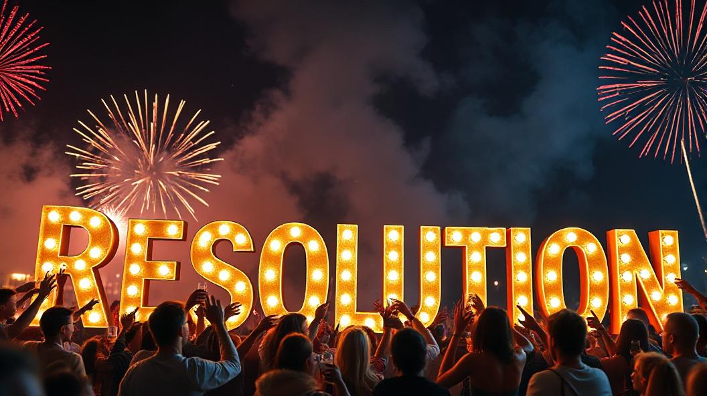

note:

How many people made a new years resolution this year? (ask for hands to go up)

Put your hand down if it's already failed

Clock strikes 12 and I declared in 2025 I want to drink a lot less... 

Then had friends from Scotland arrive and I asked them what was the main thing they wanted to do in Melbourne they said:

---

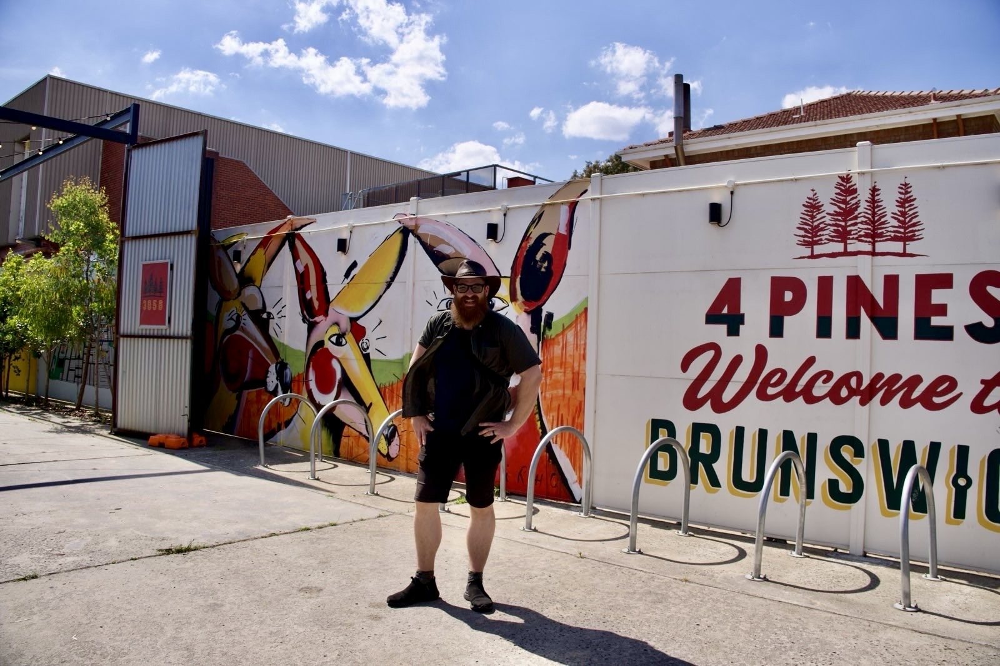

note:

"We want to check out as many breweries as possible"

... so, that resolution was quite short lived... (yes I'm up for going to the pub after work too)

But, you know what makes me feel better? 

*It's not just me that has already hit this problem...* many people share where i"m currently at

Let's look at Gyms in 2 numbers:

---

# 12.5%
# 80%

notes:

[Source - glofox](https://www.glofox.com/blog/6-new-years-resolution-gym-statistics-you-need-to-know/)

12.5% of yearly new gym signups are in January

80% of these sign ups cancel their membership before mid year

Or.. as the old joke goes...

---

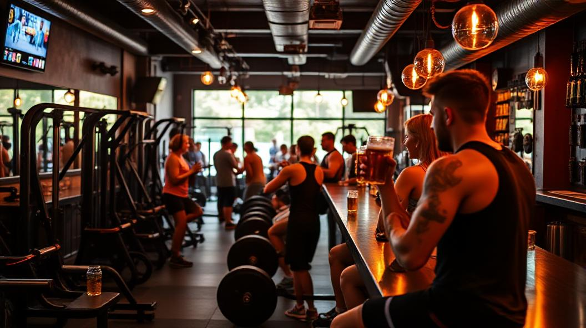

note:

I'm going to open a place that's a gym for two months and becomes a bar for 10 months and call it "resolutions"

---

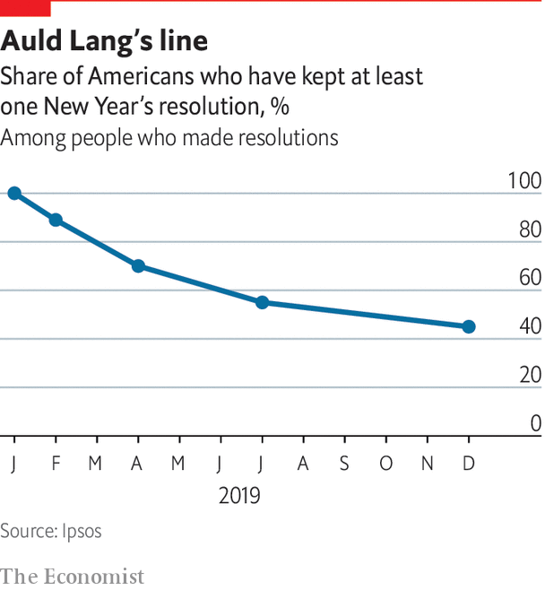

note:

So why is this such a common experience for everyone?

Because new years resolutions suck

---

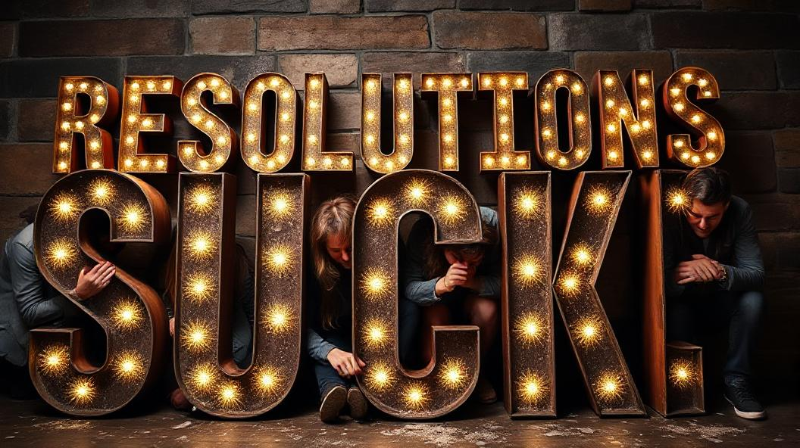

notes:

A significant amount of people set goals just before the end of the year then bail out of that goal as soon as they hit an issue. Like, random example, friends from Scotland coming to town

So what does work?

---

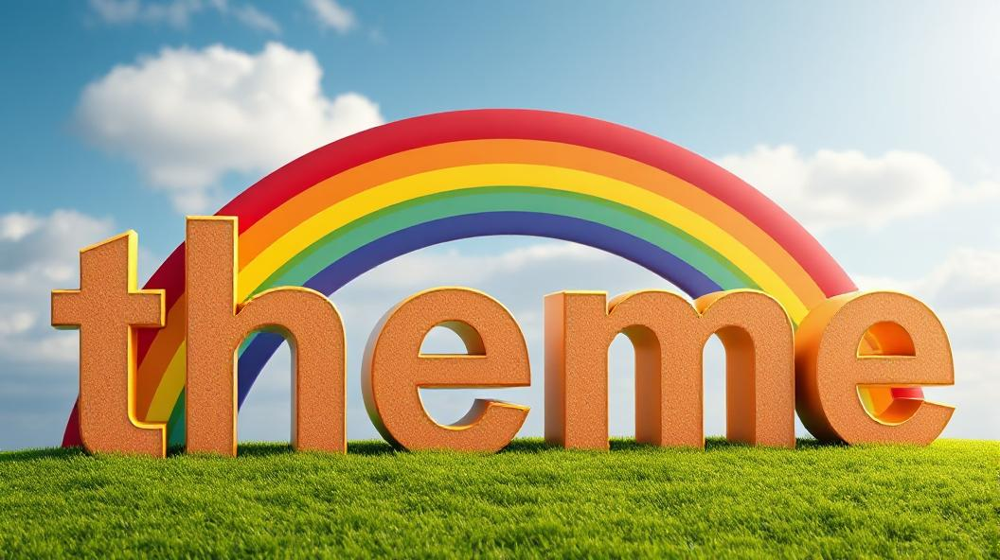

notes:

"hey it's the name of the talk!"

Give yourself a theme!

Hey Callum, what are you talking about?

---

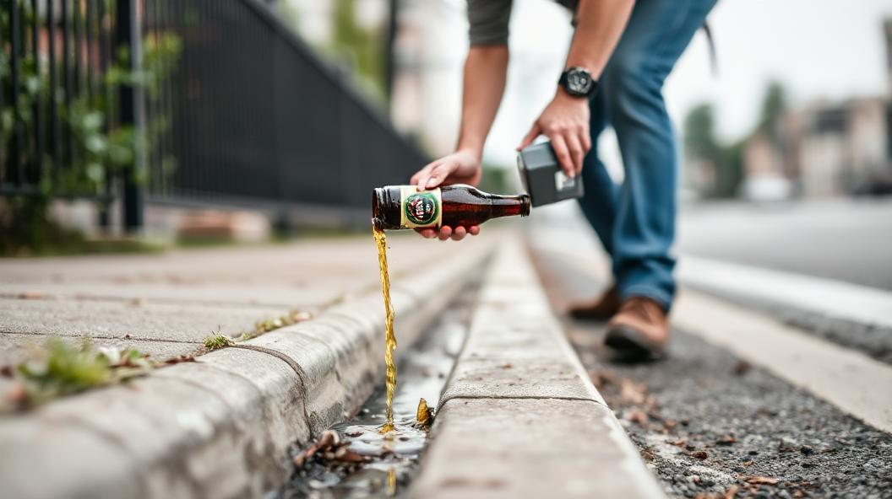

notes: 

So, the whole idea is;

Instead of setting yourself up to fail with,

“I'm going to stop drinking next year,”

or 

---

notes: 

"I'm going to read one book a week, at least”

We can set an abstract theme something like 'Year of health' or 'Year of Reading'

Now if that sounds a bit broad, that's kind of the point.

---

notes:

What we're worried about here is the trend line going up

If the trend is going in the right direction, so are you.

Or as James clear puts it

---

> If you get 1% better each day for one year, you'll end up 37 times better by the time you're done.

~ **Atomic Habits** by James Clear

notes:

Sidebar: There's many presentation James Clear has on youtube about his book if you're not up for reading it that i'd suggest checking out

Ok, how does a theme help?

---

# 122

notes:

[Source - Ementelist](https://ementalist.com/how-many-decisions-do-we-make-each-day/)

You make on average around 122 "informed" decisions day to day

Informed as in "active" decisions, like "what should I eat for lunch"

Our Theme gives us a decision framework to fall back on for every one of these

---

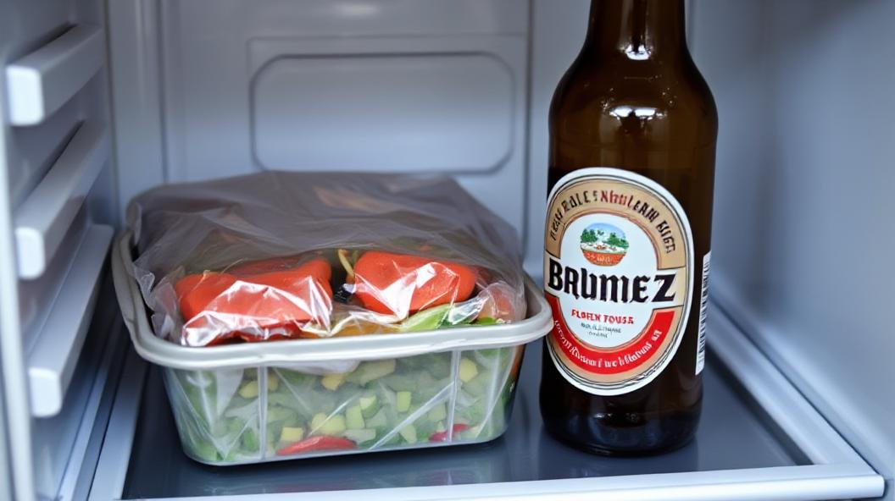

notes:

For example if my theme is "Year of health" and I get asked whether I want to go to the pub for lunch.

I now have a framework to help me make that choice

The "Health" choice is maybe to eat my packed lunch in the fridge

Or if I do go to the pub maybe I can just get a salad...... or maybe a pot over a pint....

---

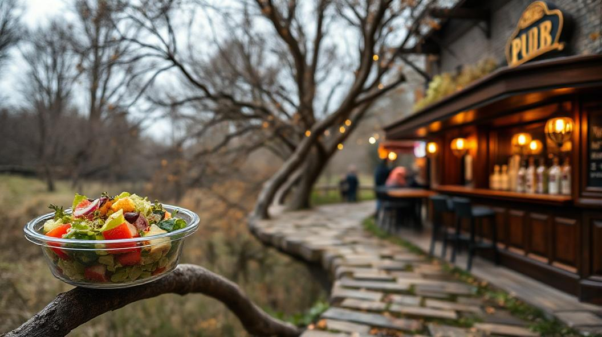

notes:

The point here is for each of these 122 decisions, using our theme as a framework will push our

Trendline upward

Ok an example

---

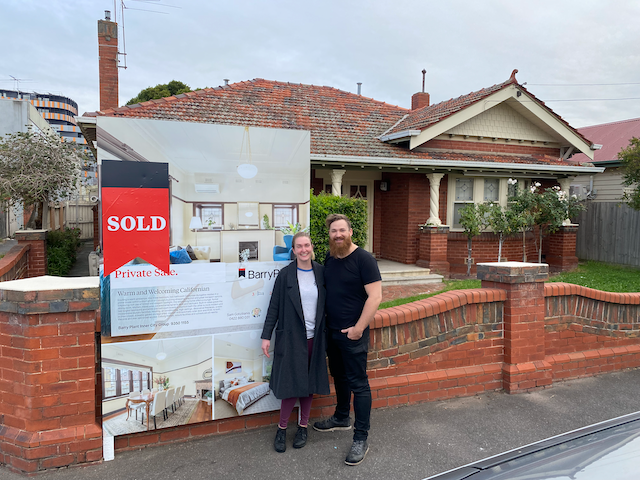

notes:

In 2023 (hey it's me!) 

I'd just moved jobs (to my current one at ANZ), bought a house (which required a bunch of work) and my wife and I were talking about having children

I needed to focus on getting my life in order

---

I'm going to do `n` things per `t` time

note:

So instead of setting up my goals of "I'm going to do `n` things per `t` time" like
- "I'm going to Exercise `n` times a week" or 
- "Cook at least `n` meals a week"

---

notes:

I set my theme as the "Year of Stability"

---

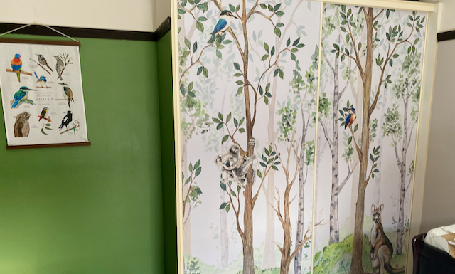

notes:

So I made the branching path choices and ended up with a fully painted nusery (pictured here), solar panels, a bunch of new recipes and a new hatrid for weight lifting etc.

But what was really interesting is that stability started to take on more meaning, I started focusing on strengthening my relationships with friends, putting dedicated "couple time" in my calendar and changing my work approach to take myself out of critical paths

---

notes:

Because the point is: A good theme can't fail, it's a broad direction you set to navigate your life

Whether that's your personal life *or* work life

Sidebar; yes that is a ship sailing a sea of beer, just wanted to make that clear

---

notes:

Ok, how do we make this practical... aka

"Wow Callum this is fantastic, I don't really understand but I like the beer part of it, how do I get started?"

---

# (My Theme)

## Why?

## Ideal Outcomes

notes:

Our basic template consists of 3 parts

The Theme, The Why and Outcomes

---

## Why?

notes:

Step 1. Is actually.. the "why?", what would I like to change, improve upon

So, we're my favourite prompt is "what do I really *want* to change and why?" 

and be honest! this is for you

For example

---

## Why?

> I'm spending too much time on my phone doomscrolling Tiktok and my concentration is all over the place. This is my year to reduce my screen time and get back into reading and I really want to find a community that I can share my progress with.

notes:

I might have been a little _too_ honest when coming up with this example

(read why)

Great we've got our why so lets work backward to a broad "directional" phrase that resonates

---

## Year of Reducing screen time
## Year of Focus
# Year of Reading

notes:

Spend time on coming up with your theme, iterate on this, talk to friends and family bout it

 "Year of reducing screen time" to specific
 "Year of Focus" is good but I want it to be about reading
 Well... yeah 

---

# Year of Reading

## Ideal Outcomes

notes:

"Year of Reading!"

Ok, Now we can define what our "Ideal Outcomes" would be

These is where we pick high level deliverables that are easily achievable

Essentially they're going to act as a guide for us to refer to if we need.. and don't worry you can change them later

---

## Ideal Outcomes

- Read 12 new books
- Join a local book club
- Less than 2 hours of screen time per day
- Develop consistent bedtime routine
- Update my progress on Goodreads

notes:

Well I wanted to read more so I'd like to read a bunch of books

I wanted to find a community, let's try good reads and ANZ has a book club I could probably join

I was worried about TikTok maybe I set screentime filtering on that

You guys get it... 

If you don't hit the outcomes throughout your year, that's ok... it's progressing that's the point.

This is something to refer to if you need but don't set it as gospel

Ok, another quick example

---

# Year of Health

---

## Why?

> I want to improve my sleep and general health so I can keep up with my daughter rather than being tired all the time. This year I want to focus on good nutrition, building more active time into my day and sleeping better

---

## Outcomes
- Complete 10k run
- Meal prep lunches most days
- Clothes fit better
- Pain in shoulder reduced
- Less screen time before bed

notes:

You get it

---

notes:

this feels very life-coachy how does it relate to work?

because I guarantee your theme will also be applicable to your work

---

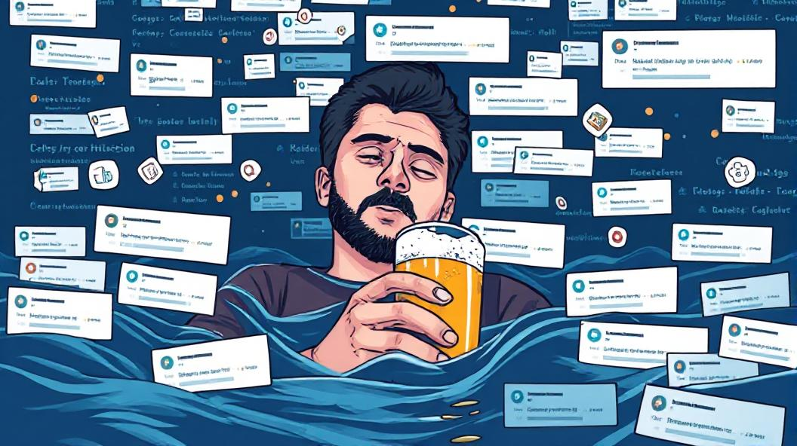

notes:

My "year of reading" could consist of learning new technical concept, spending more time in PRs, even writing more documentation (hah just kidding)

"Year of health" could include things like setting specific blocks of focus time, changing your commute to cycle to work, even reducing work anxiety by finally wrangling the millions of notifications you get

---

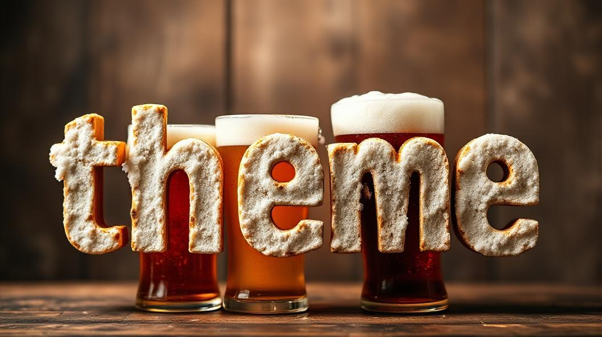

notes:

it's broad enough to give you that framework to make those decisions

ok

congrats! we've set our theme! can we get some smiley faces in the chat

talk over?

well I have some tips and tricks that help really solidify it

Tip 1:

---

# Mihaly Csikszentmihalyi

---

notes:

Mi-hai can't-pronounce-his-last-name

He's the guy who recognised and named the psychological concept of "flow"

We may refer to it as "in the zone", head in the game etc.

([A nice source for this part is a youtube short](https://www.youtube.com/shorts/thsLNYzSkeo))
([Wikipedia on Mihaly](https://en.wikipedia.org/wiki/Mihaly_Csikszentmihalyi))

---

notes:

He talks about a concept that I love which is:

"Rig the game so you are always feeling some sort of progress"

the most motivating thing is to give yourself a tangible sense of progress toward your goals

---

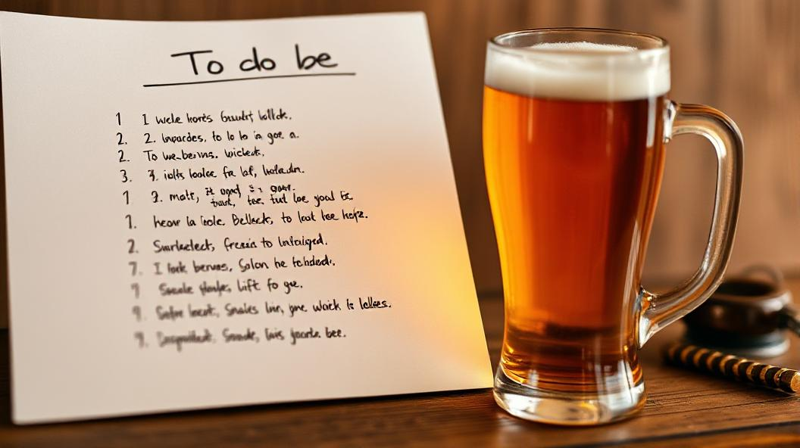

notes:

what does this mean in practice?

break the outcomes down into the smallest pieces and check them off constantly

to go back to our "year of reading" example from before

---

# Year of Reading

## Why?

> ...
## Ideal Outcomes

- Read 12 new books
	- Read a chapter of a book
		- Read 1 page of a book

notes:

We can break our "read books" outcome into tiny pieces

So maybe my todo list every day is... read 1 page of a book. man it feels good to tick off todo list items

---

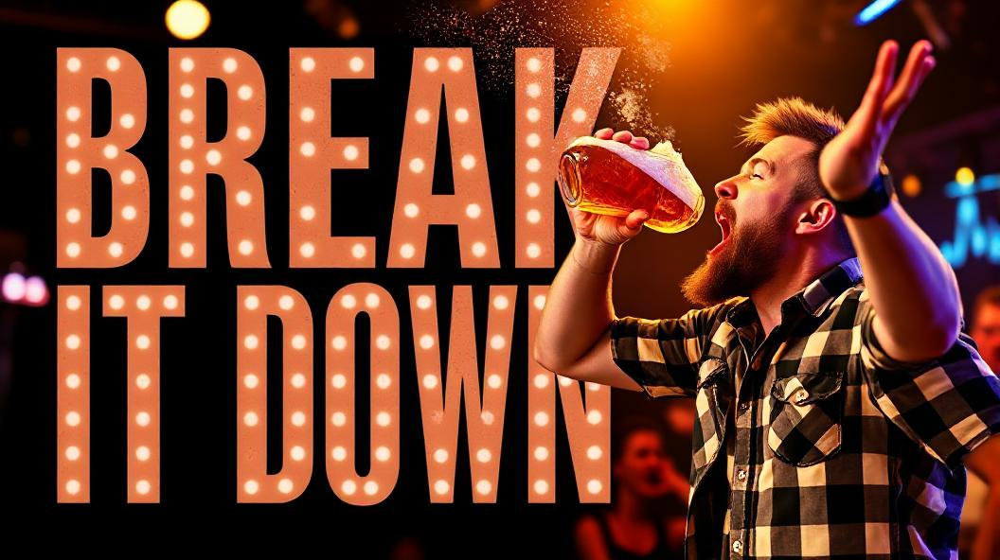

notes:

So tip 1 is "Break it down"

And tip 2 is pretty straightforward

---

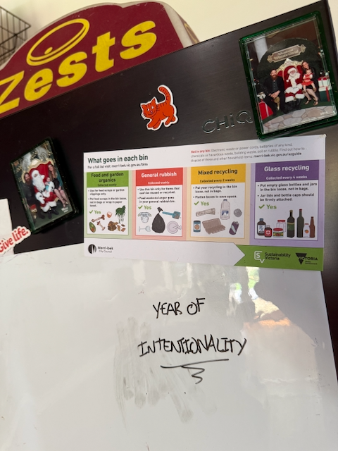

notes:

Write your theme down somewhere you're going to see it every day

The fridge, the toilet, your desk... whatever works

You want to keep it front of mind

Side note: you get to see my amazing handwriting here and photos of my family with Santa that I haven't yet taken down

Ok... talk is finally over... so... to summarise

---

# Pick a theme
# Start with "Why?"
# Ideal outcomes
# Break it down
# Write it down

##### Beer?

notes:

(read above)

---

https://www.themesystem.com/

https://www.relay.fm/cortex/162

notes:

A lot of these concepts come from different places that i've mashed together but the main person to check out is CGP Grey if you have time 

They have a physical journal which honestly you don't need but is great if you like paper

They also spend 2 hours talking through their themes every year so if you'd like someone to go into excruciating detail about examples check out these links

Ok, lastly the most important number

---

# 44

notes:

Is the number of beers that appeared today

Thanks

---

Example Questions:
- What if I get sick of my theme can I change it?
- How does this apply to creating new habits?
- When can we go for a beer?
